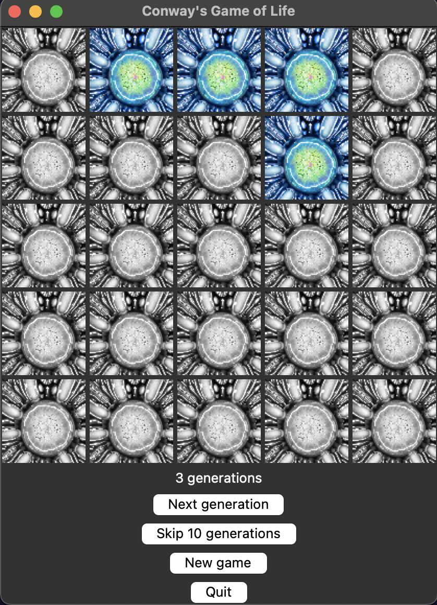

<a name="readme-top"></a>

[![Contributors][contributors-shield]][contributors-url]
[![Forks][forks-shield]][forks-url]
[![Stargazers][stars-shield]][stars-url]
[![Issues][issues-shield]][issues-url]
[![MIT License][license-shield]][license-url]


<h3 align="center">ConwayPy</h3>

  <p align="center">
    A Python implementation of Conway's Game of Life. Features a cool and exciting user interface made with Tkinter!
    <br />
    <a href="https://github.com/hisk2323/ConwayPy"><strong>Explore the docs »</strong></a>
    <br />
    <br />
    ·
    <a href="https://github.com/hisk2323/ConwayPy/issues">Report Bug</a>
    ·
    <a href="https://github.com/hisk2323/ConwayPy/issues">Request Feature</a>
  </p>
</div>


<!-- TABLE OF CONTENTS -->
<details>
  <summary>Table of Contents</summary>
  <ol>
    <li>
      <a href="#about-the-project">About The Project</a>
      <ul>
        <li><a href="#built-with">Built With</a></li>
      </ul>
    </li>
    <li>
      <a href="#getting-started">Getting Started</a>
      <ul>
        <li><a href="#prerequisites">Prerequisites</a></li>
        <li><a href="#installation">Installation</a></li>
      </ul>
    </li>
    <li><a href="#usage">Usage</a></li>
    <li><a href="#roadmap">Roadmap</a></li>
    <li><a href="#contributing">Contributing</a></li>
    <li><a href="#license">License</a></li>
    <li><a href="#contact">Contact</a></li>
    <li><a href="#acknowledgments">Acknowledgments</a></li>
  </ol>
</details>


<!-- ABOUT THE PROJECT -->
## About The Project
A simple Python-based app for running Conway's Game of Life, with a cool graphical interface!
Initially created for a class assignment, I found this project quite fun to work on and plan to continue maintaining it!

<p align="right">(<a href="#readme-top">back to top</a>)</p>


### Built With

* [![Python][Python-badge]][Python-url]

<p align="right">(<a href="#readme-top">back to top</a>)</p>


<!-- GETTING STARTED -->
## Getting Started

This project is quite simple to get running locally. Just make sure you have a functional Python installation!

### Prerequisites

You will need [Python](https://www.python.org/) installed before you can this app up and running.

### Installation


1. Clone the repo
   ```sh
   git clone https://github.com/hisk2323/ConwayPy.git
   ```
2. Run it!
   ```sh
   python conway.py
   ```

<p align="right">(<a href="#readme-top">back to top</a>)</p>


<!-- USAGE EXAMPLES -->
## Screenshots




<p align="right">(<a href="#readme-top">back to top</a>)</p>


<!-- ROADMAP -->
## Coming Features

- [ ] Improved 'skip 10 generations' feature - will animate each generation rather than simply showing the end result

See the [open issues](https://github.com/hisk2323/ConwayPy/issues) for a current list of known issues or other planned features!

<p align="right">(<a href="#readme-top">back to top</a>)</p>


<!-- CONTRIBUTING -->
## Contributing

Contributions are what make the open source community such an amazing place to learn, inspire, and create. Any contributions you make are **greatly appreciated**.

If you have a suggestion that would make this better, please fork the repo and create a pull request. You can also simply open an issue with the tag "enhancement".
Don't forget to give the project a star! Thanks again!

1. Fork the Project
2. Create your Feature Branch (`git checkout -b feature/AmazingFeature`)
3. Commit your Changes (`git commit -m 'Add some AmazingFeature'`)
4. Push to the Branch (`git push origin feature/AmazingFeature`)
5. Open a Pull Request

<p align="right">(<a href="#readme-top">back to top</a>)</p>


<!-- LICENSE -->
## License

Distributed under the MIT License. See `LICENSE.txt` for more information.

<p align="right">(<a href="#readme-top">back to top</a>)</p>


<!-- CONTACT -->
## Contact

Project Link: [https://github.com/hisk2323/ConwayPy](https://github.com/hisk2323/ConwayPy)

<p align="right">(<a href="#readme-top">back to top</a>)</p>


<!-- MARKDOWN LINKS & IMAGES -->
<!-- https://www.markdownguide.org/basic-syntax/#reference-style-links -->
[contributors-shield]: https://img.shields.io/github/contributors/hisk2323/ConwayPy.svg?style=for-the-badge
[contributors-url]: https://github.com/hisk2323/ConwayPy/graphs/contributors
[forks-shield]: https://img.shields.io/github/forks/hisk2323/ConwayPy.svg?style=for-the-badge
[forks-url]: https://github.com/hisk2323/ConwayPy/network/members
[stars-shield]: https://img.shields.io/github/stars/hisk2323/ConwayPy.svg?style=for-the-badge
[stars-url]: https://github.com/hisk2323/ConwayPy/stargazers
[issues-shield]: https://img.shields.io/github/issues/hisk2323/ConwayPy.svg?style=for-the-badge
[issues-url]: https://github.com/hisk2323/ConwayPy/issues
[license-shield]: https://img.shields.io/github/license/hisk2323/ConwayPy.svg?style=for-the-badge
[license-url]: https://github.com/hisk2323/ConwayPy/blob/main/LICENSE.txt
[product-screenshot]: assets/screenshot1.png
[Python-badge]: https://img.shields.io/badge/python-3670A0?style=for-the-badge&logo=python&logoColor=ffdd54
[Python-url]: https://python.org/